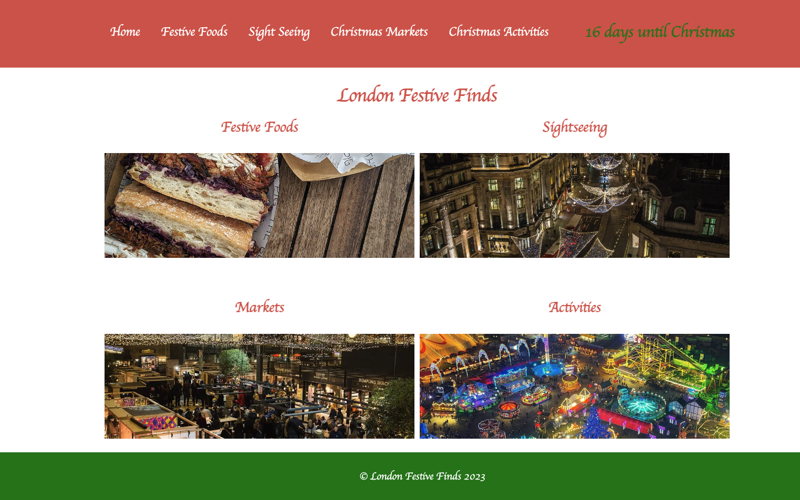

# SEI Unit 1 Project ReadMe


## Project Description

LondonFestiveFinds is a dynamic website crafted to lead both tourists and Londoners through the captivating Christmas experiences across the city. Covering everything from festive markets to delightful food spots, iconic sightseeing places to engaging activities, and even a curated list of Christmas films, the site is your go-to platform for all things Christmas in London. This project provided an excellent opportunity to explore Typescript, a new language for me, ensuring that the entire project is developed using React with Typescript.

## Table of Contents

- [Deployment Link](#deployment-link)
- [Technologies Used](#technologies-used)
- [Planning](#planning)
- [Build Process](#build-process)
- [Challenges](#challenges)
- [Wins](#wins)
- [Key Learnings/Takeaways](#key-learningstakeaways)
- [Future Improvements](#future-improvements)

## Deployment Link

(https://jeeivan.github.io/festive-finds)

## I gave myself 2 days to work on this project and I worked independently to do this. 

## Technologies Used

TypeScript, React, HTML, CSS

## Planning

**Database**

Data Storage: Hardcoded Json Object
**Categories:**
Markets
Activities
Festive Food Spots
Sightseeing Places

**Fields for Each Category:**
Name
Location
What there is to do (for Activities)
Popular food (for Festive Food Spots)
Info about the place (for Sightseeing Places)
Image
Dates

**Website Structure**

**Home Page**
Features:
Big picture cards for each main page
Navigation Bar
Elements:
Links to main pages
Christmas Countdown


**Activities Page**
Features:
Map displaying activity locations using data
Individual pages for each activity

**Festive Food Page**
Features:
Map displaying food spot locations using data
Individual pages for each festive food spot

**Sightseeing Places Page**
Features:
Map displaying sightseeing locations using data
Individual pages for each sightseeing place

**Markets Page**
Features:
Map displaying market locations using data
Individual pages for each market place


**Individual Page Structure**
Elements:
Name
Location
Image
Dates (if applicable)


## Build Process

**Setting up the pages**

To organise my project effectively, I ensured that different files were placed in their respective folders. I established paths for each page and rigorously tested them to guarantee seamless functionality.

```
function App() {
  return (
    <main className="App">
            <Navbar />
            <Routes>
            <Route path='/festive-finds' element={<Home/>} />
            <Route path='/Markets' element={<Markets/>} />
            <Route path='/Festivefoods' element={<FestiveFoods/>} />
            <Route path='/fooddetailpage/:food' element={<FoodDetailPage/>} />
            <Route path='/activitydetailpage/:activity' element={<ActivityDetailPage/>} />
            <Route path='/marketdetailpage/:market' element={<MarketDetailPage/>} />
            <Route path='/sightdetailpage/:sight' element={<SightSeeingDetailPage/>} />
            <Route path='/Sightseeing' element={<SightSeeing/>} />
            <Route path='/Activities' element={<Activities/>} />
            </Routes>
            <Footer />
    </main>
  );
}
```

**Hardcoding Database**

I knew this part would be one of the longest things to do. I spent quite some time researching markets, sightseeing places, festive foods and christmas activities that I wanted to include in my website. Then after collecting all the information I needed I made these into their own separate json files.

```
{
  "sightseeingPlaces": [
    {
      "name": "Christmas at Kew/ Kew Gardens Christmas",
      "location": "Royal Botanical Gardens",
      "nearestStation": "Kew Gardens Station",
      "description": "Experience the enchanting Christmas at Kew Gardens, surrounded by the beauty of the Royal Botanical Gardens. Immerse yourself in the festive atmosphere with dazzling lights, seasonal displays, and a magical journey through the gardens.",
      "img": "https://media.timeout.com/images/105725761/750/422/image.jpg",
      "dates": "Jan 7 2023"
    },
    {
      "name": "Regent Street Christmas Lights",
      "location": "Regent Street",
      "nearestStation": "Oxford Circus Station",
      "description": "Witness the grandeur of Regent Street adorned with spectacular Christmas lights. This iconic display transforms Regent Street into a glittering winter wonderland, creating a magical ambiance for all to enjoy.",
      "img": "https://www.regentstreetonline.com/media/iltemeja/the-spirit-of-christmas-by-regent-street.jpg",
      "dates": "Early Jan 2024"
    }
```

**Grabbing data from Database**

Recognising that this aspect would consume a substantial amount of time, I dedicated effort to thorough research on markets, sightseeing places, festive foods, and Christmas activities to be featured on my website. After compiling all necessary information, I structured them into individual JSON files.

```
export default function Markets() {
  return (
    <div className="markets-container">
      <h2 className="markets-title">Christmas Markets</h2>
      <div className="markets-list">
        {marketsData.markets.map((market, index) => (
          <Link to={`/marketdetailpage/${market.name}`}>
          <div key={index} className="market-item">
            <h3 className="market-name">{market.name}</h3>
            
          </div>
            </Link>
        ))}
      </div>
    </div>
  );
}
```

## Challenges

One significant challenge encountered during this project involved setting up individual pages for each data item. The difficulty lay in retrieving data for a specific item. After extensive research, I explored and successfully implemented the ‘find’ method, enabling me to retrieve the specific item required.

```
export default function FoodDetailPage() {
  const { food } = useParams(); 

  const selectedFood = foodsData.food.find((item) => item.name === food);

  if (!selectedFood) {
    return <div>Food not found</div>;
  }

  return (
    <div className="page-container">
      <h1>{selectedFood.name}</h1>
      <p>Location - {selectedFood.location}</p>
      <p>{selectedFood.description}</p>
      {selectedFood.price && 
      <p>Price - £{selectedFood.price}</p>
      }
      
    </div>
  );
}
```

## Wins

I am particularly pleased with successfully implementing the Christmas countdown using TypeScript, ensuring precise specification of variable types.

```
export default function Countdown() {
    const [daysLeft, setDaysLeft] = useState(calculateDaysLeft());
  
    function calculateDaysLeft(): number {
      const christmasDate: Date = new Date('December 25, 2023 00:00:00 GMT');
      const currentDate: Date = new Date();
      const differenceInTime: number = christmasDate.getTime() - currentDate.getTime();
      const daysLeft: number = Math.floor(differenceInTime / (1000 * 3600 * 24));
      return daysLeft >= 0 ? daysLeft : 0; // Avoids displaying a negative number
    }
  
    useEffect(() => {
      const interval = setInterval(() => {
        setDaysLeft(calculateDaysLeft());
      }, 86400000); // Update every 24 hours
  
      return () => clearInterval(interval);
    }, []);
  
    return (
      <div className="countdown-container">
        <p>{daysLeft} days until Christmas</p>
      </div>
    );
  };
```

## Key Learnings/Takeaways

Having completed my third project with React, I now feel significantly more confident in utilizing this framework.
This side project marked a significant milestone as my first venture outside of the General Assembly bootcamp. I am proud of proactively resolving blockers independently, without the need for instructor assistance.

## Future Improvements

While I'm content with achieving the desired degree of functionality within the given timeframe, I envision future improvements that would afford me more opportunities to practice and explore TypeScript's full potential.
